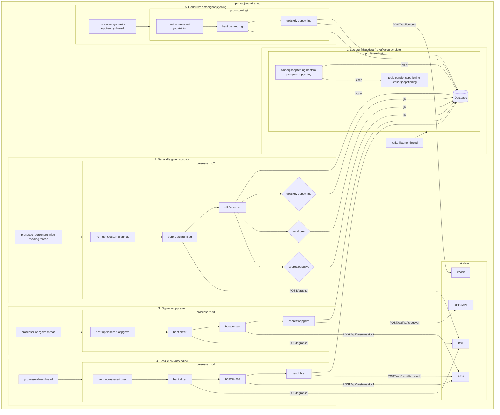

# omsorgsopptjening-bestem-pensjonsopptjening

Sammenstiller grunnlagsdata for barnetrygd og hjelpestønad og avgjør om omsorgsopptjening kan godskrives automatisk.

## Bakgrunn

Applikasjonen er en erstatter for prosesseringsløpet som tidligere ble utført av

* [BPEN032 Importer barnetrygdsvedtak og hjelpestønadsvedtak](https://confluence.adeo.no/pages/viewpage.action?pageId=280294000)
* [BPEN030 Godskriv omsorgspoeng fra barnetrygd og send brev](https://confluence.adeo.no/display/PEN/BPEN030+-+Godskriv+omsorgspoeng+fra+barnetrygd+og+send+brev)

Alle funksjonelle behandlingsregler (implisitt og eksplisitt) fra de nevnte batchene er forsøkt bevart så godt det lar
seg gjøre.

## Arkitektur

[Overordnet arkitektur omsorgsopptjening](https://confluence.adeo.no/x/Gl_qHg)

## Intern arkitektur

Applikasjonen er delt inn i følgende distinkte steg som opererer uavhenging av hverandre:

1. Les grunnlagsdtata fra kafka og persister
2. Behandle grunnlagsdata, herunder
   1. Berikelse
   2. Vilkårsvurdering
   3. Avgjøre om oppgave skal opprettes
   4. Avgjøre om brev skal sendes
   5. Avgjøre om omsorgsopptjening skal godskrives
3. Opprette oppgaver
4. Bestille brevutsending
5. Godskrive omsorgsopptjening

### Felles for alle steg
#### Transaksjonshåndtering

Prosesseringen av hvert steg er designet for å understøtte følgende:

* Muliggjøre oppdatering av status når feil oppstår
   * Oppnås ved å gjennomføre prosesseringen og feilhåndteringen i to separate transaksjoner. Siden både vellykket prosessering og feilhåndtering forsøker å oppdatere den samme statustabellen er det nødvendig at transaksjonen for prosessering får committet eller rullet tilbake før feilhåndteringen gjennomføres - noe annet kan ende med deadlock.
* Muliggjøre distribuert prosessering på tvers av flere podder
   * Spørringen som henter rader for prosessering vil låse raden som velges ut for varigheten av transaksjonen. Spørringen vil også hoppe over eventuelle rader som allrered er låst, slik at andre podder ikke vil plukke opp samme rad. Kombinasjonen av disse to er årsaken til at prosesseringen og feilhåndteringen kjøres som egne transaksjoner innenfor levetiden til transaksjonen som hentet raden. Merk at det er viktig at hver av transaksjonene oppretter en ny transaksjon `PROPAGATION_REQUIRES_NEW`.
* I størst mulig grad holde datatabasen i synk med resultatet fra eksterne kall

#### Feilhåndtering

Dersom det oppstår feil under prosesseringen (exception kastes) vil statusen for den aktuelle raden som prosesseres
oppdateres, og den aktuelle raden vil havne i karantene for videre prosessering (for å unngå at feil
blokkerer prosesseringen av andre rader). Etter at karantenetiden er utløpt, vil raden forsøkes på nytt x
antall ganger opp til et maksimum - når maksimum er nådd uten at raden er prosessert ferdig, vil statusen settes til `Feilet`
og det vil være behov for manuell intervensjon.