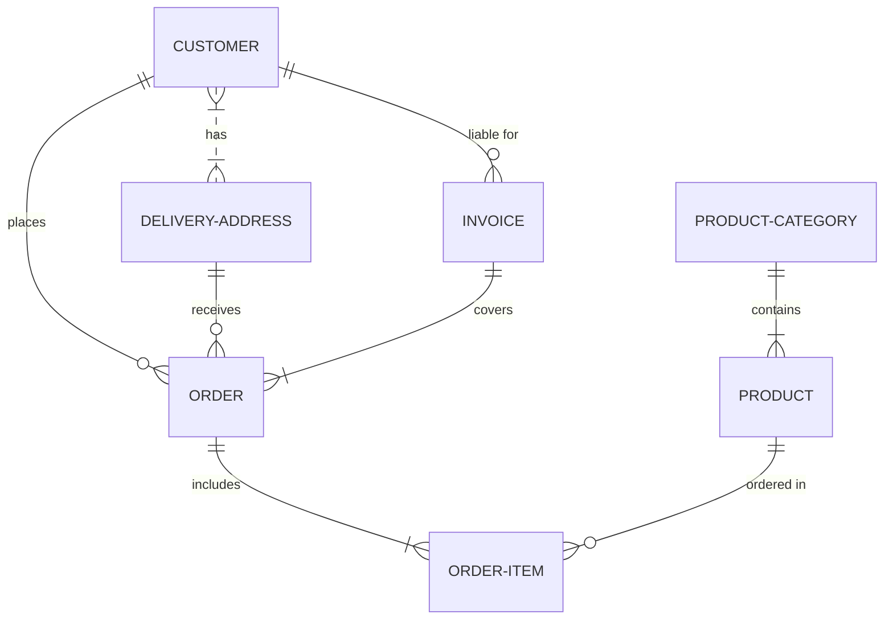

# omsorgsopptjening-bestem-pensjonsopptjening
Skal sammenstille grunnlag og avgjøre hvem som får omsorgsopptjening

## Arkitektur
[Overordnet arkitektur omsorgsopptjening](https://confluence.adeo.no/x/Gl_qHg)

## Statistikk oppgaver og brev fra BPEN030
Noen tall som forteller oss litt om hvilken størrelsesorden vi kan/bør forvente.
### Oppgaver opprettet
#### Flere omsorgsytere med like mye omsorg i fødselsår
* 2022: 86
* 2021: 94
* 2020: 101
* 2019: 131
* 2018: 133

#### Flere omsorgsytere med like mye omsorg utenfor fødselsår
* 2022: 1924
* 2021: 1173
* 2020: 1120
* 2019: 1121
* 2018: 950

#### Kunne ikke håndteres av batch
* 2022: 19
* 2021: 61
* 2020: 9
* 2019: 9
* 2018: 8

### Brev sendt
* 2022: 2979
* 2021: 2778
* 2020: 2645
* 2019: 2720
* 2018: 2732

